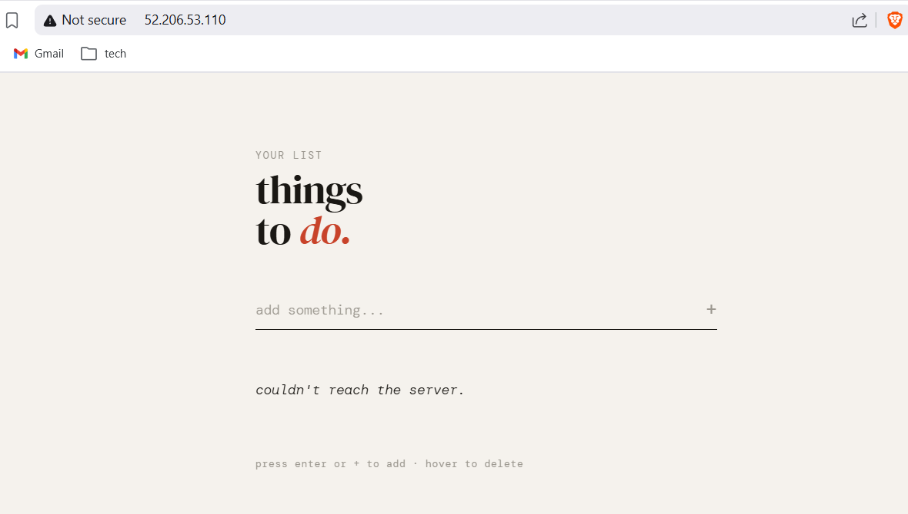
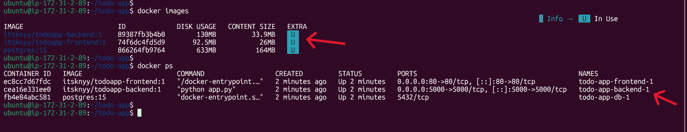
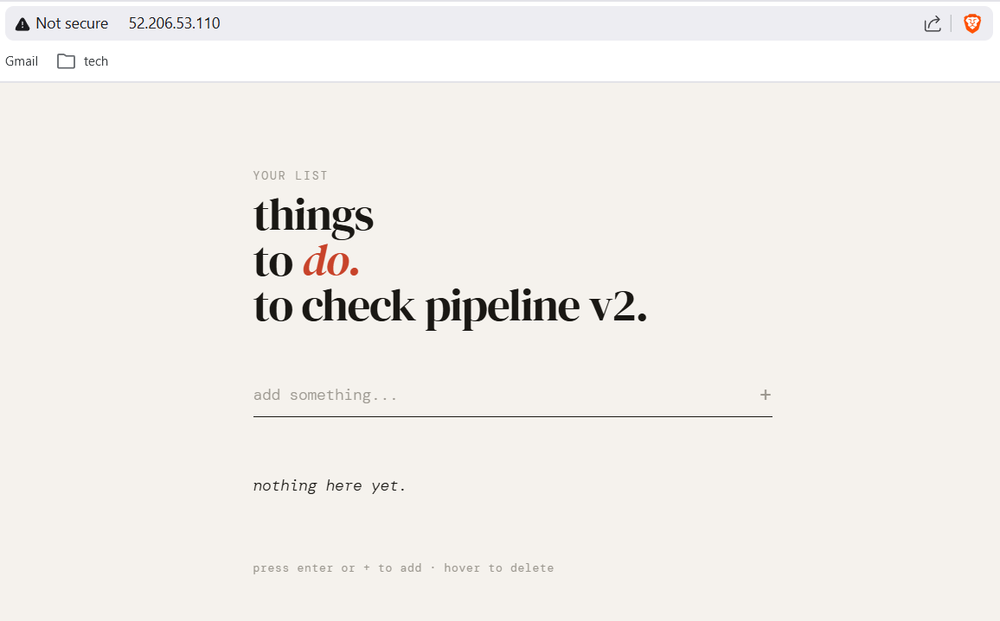
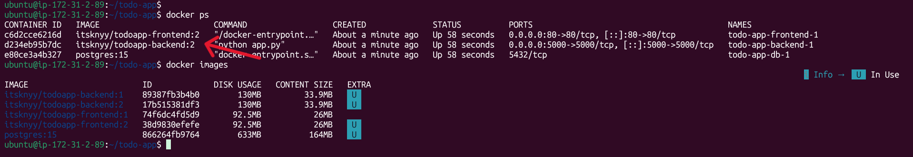

# 🚀 Dockerized Application with CI/CD on AWS EC2

# 📌 Project Overview

This project demonstrates a complete CI/CD pipeline for a containerized full-stack Todo application deployed on AWS EC2.

The objective of this project is not just building a Todo app, but implementing real-world DevOps practices including:

- Containerization with Docker
- Multi-container orchestration with Docker Compose
- CI pipeline using Jenkins
- Versioned Docker image strategy
- Automated CD deployment to AWS EC2
- Cloud hosting fundamentals

# 🎯 Project Motivation

This project was built to understand and demonstrate:

- How modern applications are containerized
- How CI/CD pipelines automate software delivery
- How cloud infrastructure integrates with DevOps workflows

Instead of using `latest` image tags, this project implements build-number versioning to simulate production-grade deployment practices.

# 🧠 Concepts Demonstrated

## 1️⃣ Containerization (Docker)
- Writing Dockerfiles
- Building and tagging images

## 2️⃣ Multi-Container Architecture
- Frontend container
- Backend container
- PostgreSQL database
- Persistent volumes

## 3️⃣ CI (Continuous Integration)
Handled by Jenkins:
- Pull code from GitHub
- Build Docker images
- Tag images with BUILD_NUMBER
- Push images to Docker Hub

## 4️⃣ CD (Continuous Deployment)
Handled via Jenkins SSH to EC2:
- Pull specific version from Docker Hub
- Run docker compose with APP_VERSION
- Update running containers automatically

## 5️⃣ Versioning Strategy
Images are tagged using Jenkins BUILD_NUMBER:
- todoapp-backend:1
- todoapp-backend:2
- todoapp-backend:3

This enables:
- Deterministic deployments
- Easy rollback
- Traceable releases

Rollback example:

`APP_VERSION=5 docker compose up -d`

# 📂 Project Structure

```
todo-app/
│
├── backend/
│   ├── app.py
│   ├── requirements.txt
│   └── Dockerfile
│
├── frontend/
│   └── Dockerfile
│
├── Jenkinsfile
└── docker-compose.yaml (stored on EC2)
```
# 🛠 Prerequisites

## 1️⃣ Accounts Required
- AWS Account
- Docker Hub Account
- GitHub Account

## 2️⃣ Local Setup
- Git
- Docker
- Jenkins (running locally)
- SSH configured

## 3️⃣ EC2 Requirements
- Ubuntu 22.04
- Ports open:
  - 22 (SSH)
  - 80 (HTTP)
  - 5000 (optional)

# 🔁 CI/CD Pipeline Flow

```
1. Developer pushes code to GitHub
2. Jenkins pipeline triggers automatically
3. Jenkins builds Docker images
4. Jenkins tags images with BUILD_NUMBER
5. Jenkins pushes images to Docker Hub
6. Jenkins connects to EC2 via SSH
7. EC2 pulls correct image version
8. Containers restart with new version

```
# 🌍 Accessing the Application (before update)

## 1. before-app-ui.png



---



---

# 🌍 Accessing the Application (after update)

## 1. after-app-ui.png



---



---

# 🎓 Learning Outcomes

This project demonstrates:

- End-to-end CI/CD implementation
- Docker image versioning strategy
- Automated cloud deployment
- Infrastructure automation basics
- Rollback capability

---

# 🚀 Future Improvements

- Use Nginx reverse proxy
- Add HTTPS using Let's Encrypt
- Implement Infrastructure as Code (Terraform)
- Move to ECS or Kubernetes
- Add monitoring (Prometheus + Grafana)

---