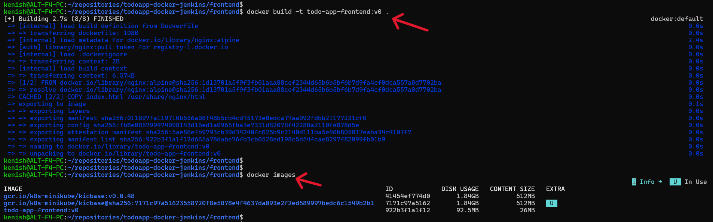
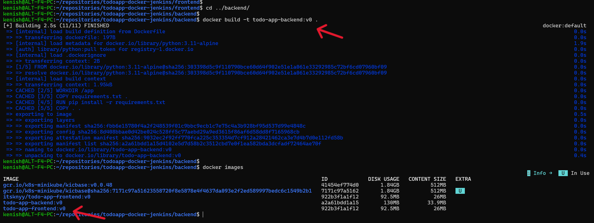
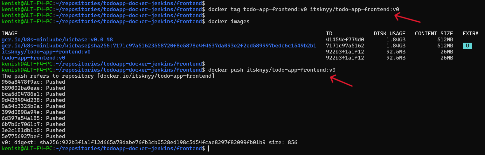
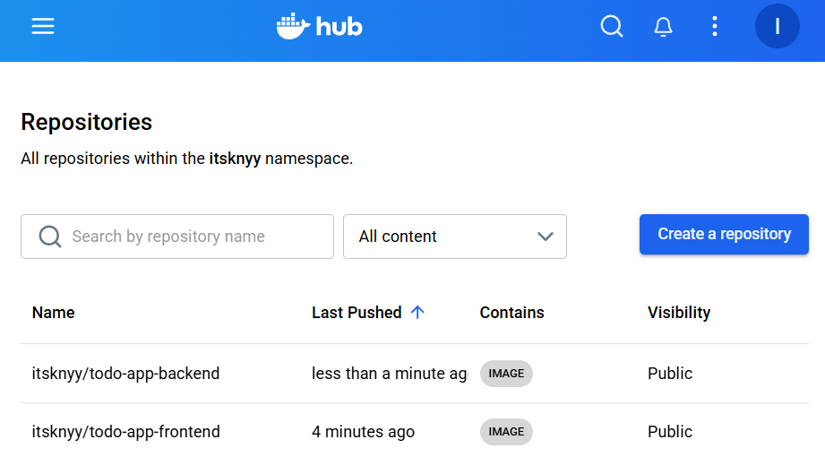
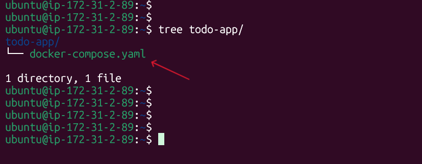
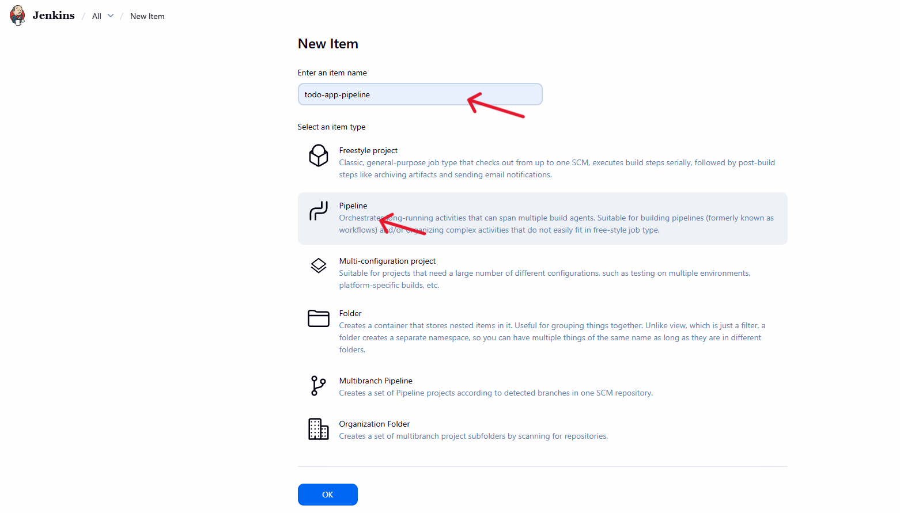
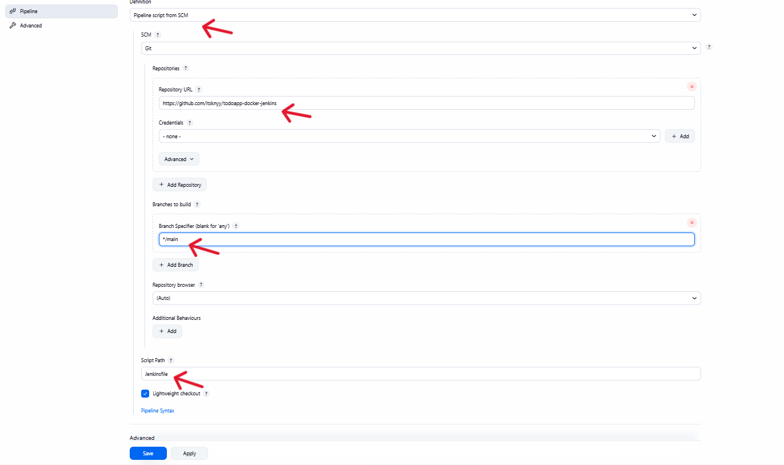
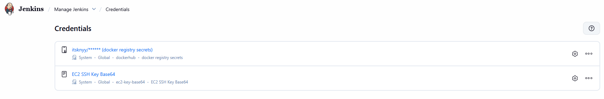

## 📘 Detailed Implementation Guide

### Step 1 – Build Frontend Docker Image



```
docker build -t todo-app-frontend:v0 .
```

- Docker reads the `Dockerfile`.
- Pulls the required base image `(nginx)`.
- Builds the frontend image.
- Tags it as `todo-app-frontend:v0`.

---

### Step 2 – Build Backend Docker Image



```
docker build -t todo-app-backend:v0 .
```

- Docker reads the backend Dockerfile.
- Pulls the base image `(python:3.11-alpine)`.
- Installs dependencies from requirements.txt.
- Builds and tags the image as `todo-app-backend:v0`.

---

### Step 3 – Tag and Push Frontend Image to Docker Hub



```
docker tag todo-app-frontend:v0 itsknyy/todo-app-frontend:v0
docker push itsknyy/todo-app-frontend:v0
```

- Tags the local image with your Docker Hub username.
- Pushes the image to Docker Hub.

> Note: Repeat the same steps for the backend image (todo-app-backend:v0).

---

### Step 4 – Verify Images on Docker Hub



- Confirm that both images are listed:
    - `itsknyy/todo-app-frontend`
    - `itsknyy/todo-app-backend`

---

### Step 5 – SSH into EC2 and Prepare docker-compose



```
ssh -i ec2.pem ubuntu@<EC2-PUBLIC-IP>
mkdir todo-app && cd todo-app
touch docker-compose.yaml
```

- Connects to the EC2 instance using SSH.
- Creates a project directory (todo-app).
- Creates the docker-compose.yaml file for defining deployment services.

---

### Step 6 – Create Jenkins Pipeline Job



- Go to Jenkins Dashboard → New Item.
- Select `Pipeline` as the project type.
- Click OK to create the pipeline job.

---

### Step 7 – Connect Jenkins to GitHub Repo



- Select `Pipeline script from SCM`.
- Choose Git and add your repository URL.
- Set branch to */main.
- Keep script path as Jenkinsfile.
- Click Save.

---

### Step 8 – Add Jenkins Credentials



- Go to Manage Jenkins → Credentials.
- Add Docker Hub credentials (username & password/token).
- Add EC2 SSH private key (for remote deployment).

---

